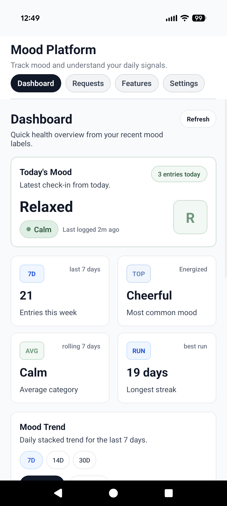
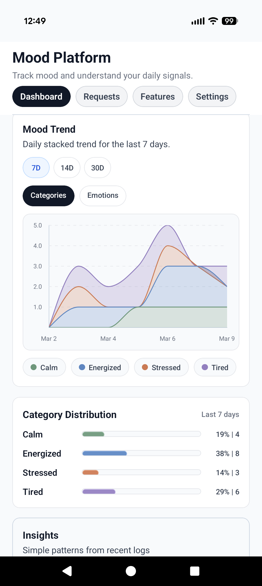
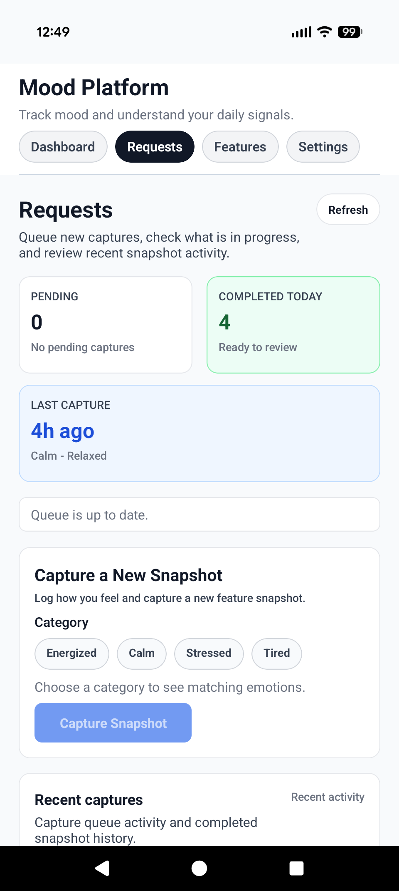
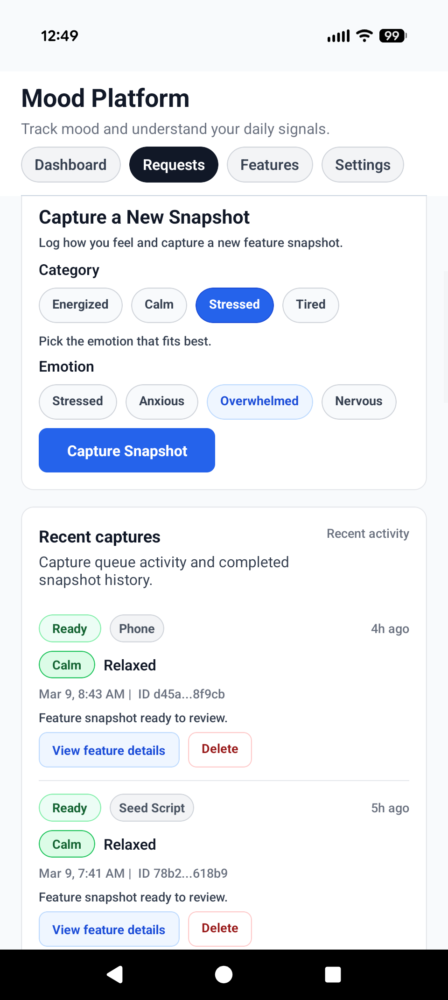
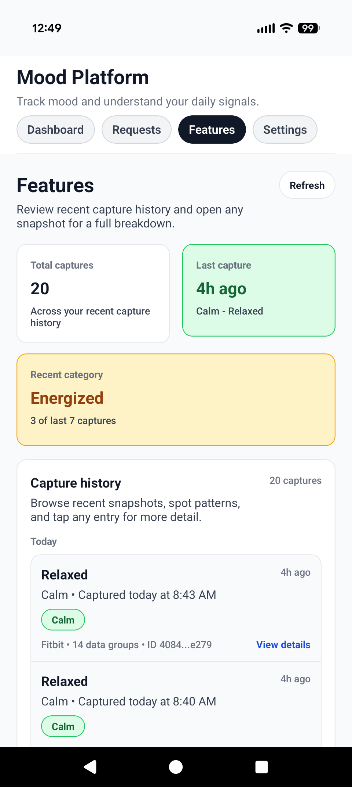
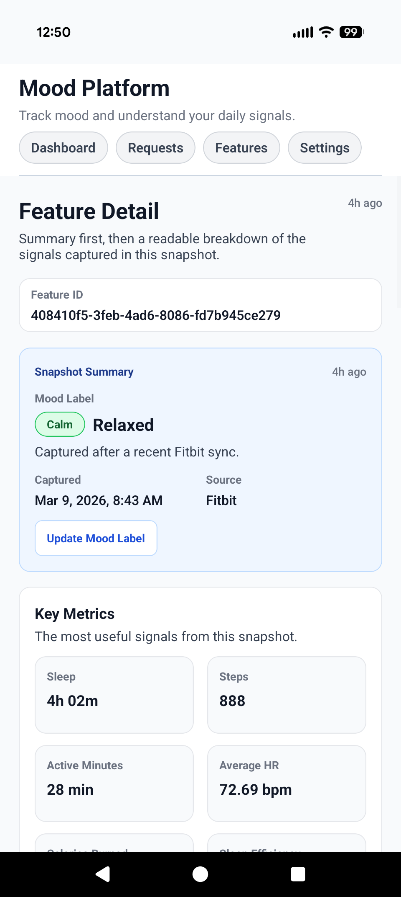
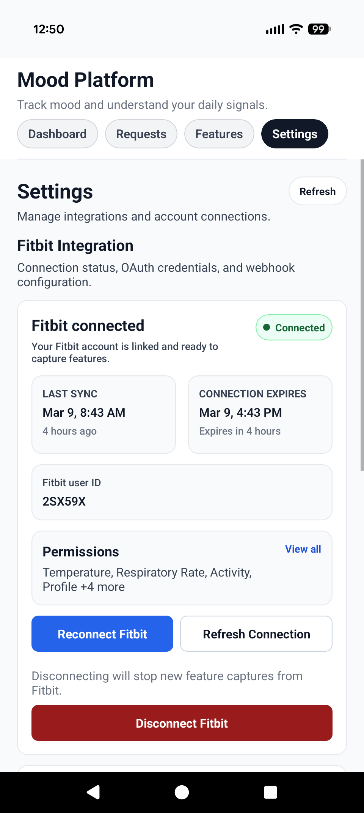
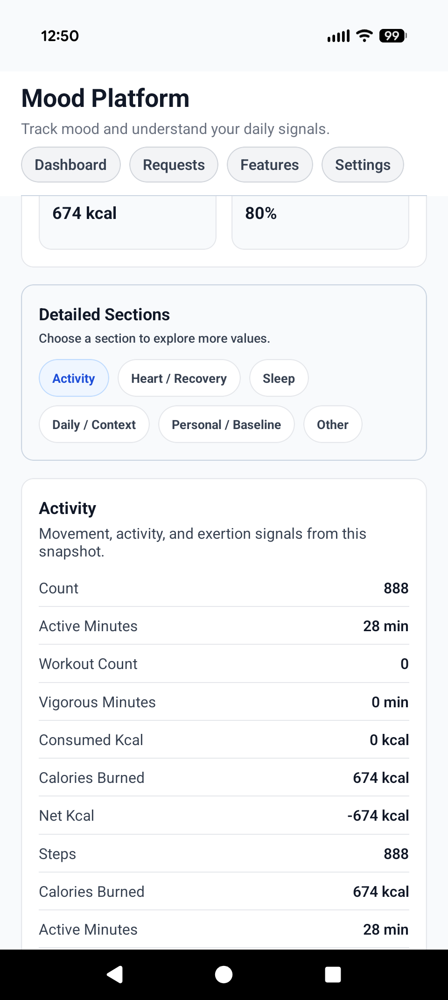

# Mood Platform

Mood Platform is a self-hostable mobile app for tracking emotional check-ins and pairing them with Fitbit-derived daily signals. The project combines an Expo mobile client, a FastAPI backend, a PostgreSQL data model, and a fulfillment worker so mood capture, snapshot generation, and Fitbit sync all work together as one product.

## What The Product Does

- Turns quick mood check-ins into a readable daily dashboard.
- Captures snapshot requests and turns them into feature records backed by Fitbit data.
- Lets users review feature history, inspect a snapshot in detail, and update linked mood labels.
- Gives the owner a managed Fitbit integration flow, including OAuth, webhook handling, and secure settings storage.
- Keeps cleanup and data ownership explicit with transactional request, snapshot, and label deletion rules.

## Product Tour

<table>
  <tr>
    <td align="center">
      <br />
      <strong>Dashboard Overview</strong><br />
      Daily mood summary, quick metrics, and recent trend context.
    </td>
    <td align="center">
      <br />
      <strong>Mood Insights</strong><br />
      Trend charts and category balance that stay readable on mobile.
    </td>
  </tr>
  <tr>
    <td align="center">
      <br />
      <strong>Capture Queue</strong><br />
      Request summaries and the main snapshot capture flow.
    </td>
    <td align="center">
      <br />
      <strong>Recent Activity</strong><br />
      Lightweight request history with clear actions and status.
    </td>
  </tr>
  <tr>
    <td align="center">
      <br />
      <strong>Feature History</strong><br />
      Snapshot browsing organized around mood-first context.
    </td>
    <td align="center">
      <br />
      <strong>Feature Detail</strong><br />
      Summary-first breakdown of the most useful captured signals.
    </td>
  </tr>
  <tr>
    <td align="center">
      <br />
      <strong>Deep Dive Sections</strong><br />
      Structured detail cards for drilling into activity, sleep, and recovery values.
    </td>
    <td align="center">
      <br />
      <strong>Owner Settings</strong><br />
      Managed Fitbit connection status and integration configuration.
    </td>
  </tr>
</table>

## Stack

- Frontend: Expo, React Native, React Navigation, TypeScript
- Backend: FastAPI, SQLAlchemy, PostgreSQL, Alembic
- Background processing: request fulfillment worker and Fitbit webhook ingestion
- Integrations: Fitbit OAuth, webhook subscriptions, feature pull orchestration
- Security: owner-managed integration settings with encrypted secret storage

## Why This Repo Is Interesting

- It is a real full-stack product flow, not just isolated UI or API exercises.
- The mobile app is organized around actual user workflows: dashboard, requests, feature history, detail views, labeling, and settings.
- The backend handles non-trivial lifecycle concerns like OAuth, webhook validation, background fulfillment, transactional cascading deletes, and encrypted secret management.
- The repository is set up to be self-hosted locally with Docker, migrations, and focused test coverage.

## Repository Map

```text
mood-platform/
|- apps/
|  |- frontend/   # Expo React Native client
|  `- backend/    # FastAPI API, services, repositories, worker
|- docs/          # organized product, setup, frontend, and backend docs
|- scripts/       # repository helpers and verification scripts
|- .env.example   # local environment template
`- docker-compose.yml
```

## Run Locally

1. Copy the environment template: `Copy-Item .env.example .env`
2. Start the local stack: `docker compose up --build`
3. Run migrations if needed: `python -m alembic -c apps/backend/alembic.ini upgrade head`
4. Launch the Expo app: `npm run --workspace apps/frontend start`
5. Save Fitbit credentials from `Settings -> Fitbit Integration` if you want to exercise OAuth and webhook flows locally

More detailed setup notes live in [docs/getting-started.md](docs/getting-started.md).

## Documentation

- [Documentation Index](docs/README.md)
- [Getting Started](docs/getting-started.md)
- [Frontend Notes](docs/frontend/README.md)
- [Backend Notes](docs/backend/README.md)
